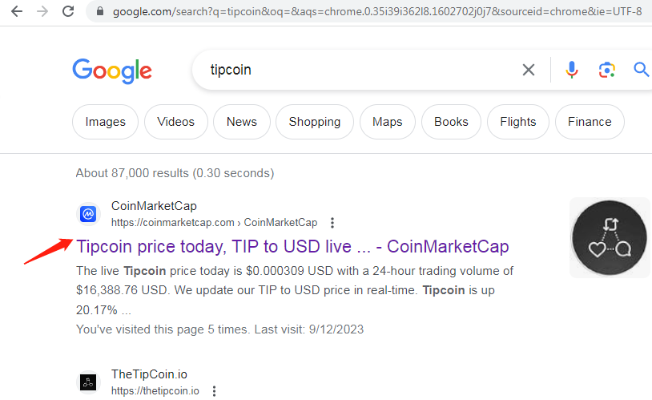
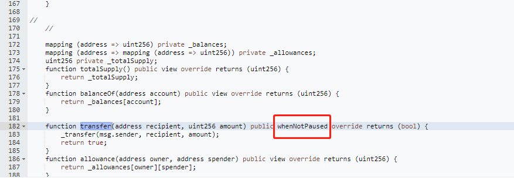
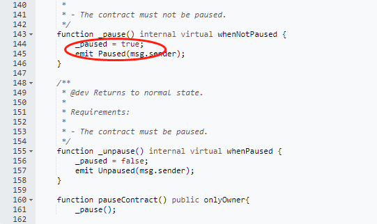
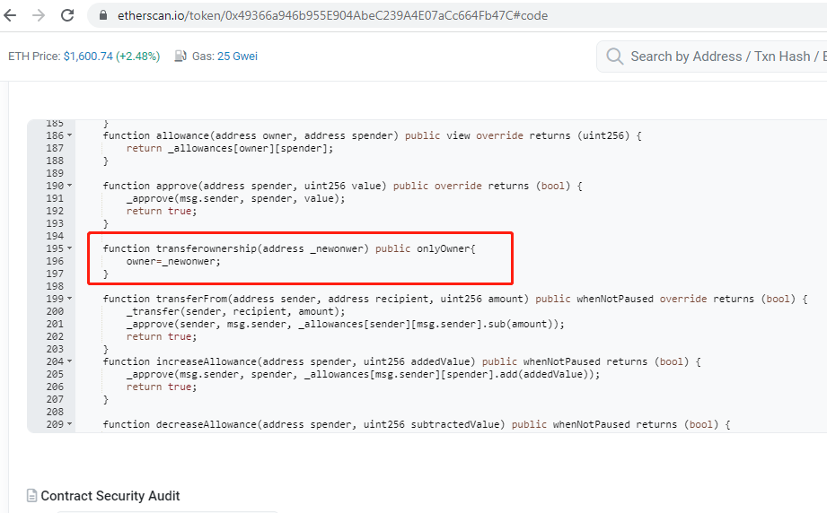
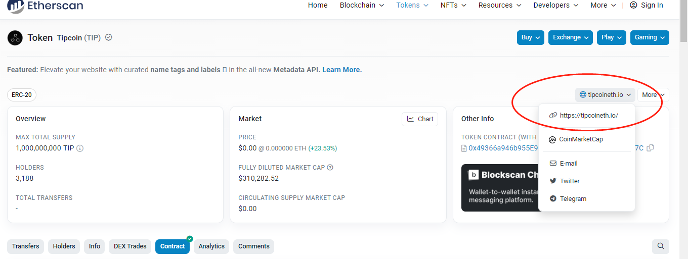

## I discovered a sniper contract that targets the trending web3 social application $tipcoineth.

## official icon

## Here are the detailed information regarding this sniper contract. Below.
## [sniper contract address](https://etherscan.io/token/0x49366a946b955E904AbeC239A4E07aCc664Fb47C)

## If you google the keywords "tipcoin", it will show you easily at CoinMarketCap site

## It's a same icon like thetipcoin.io(This is the official website)

## The token contract was deployed after thetipcoin.io, however the contract of thetipcoin.io official has not been executed yet.
## The sniper contract carries significant risks as it allows for the alteration of administrative permissions and contains privileged functions. Below:

## And the contract has a function that can be change the owner of contract

# Last point(It's important), it has one link (`https://tipcoineth.io`) that looks like the same official website link(`https://thetipcoin.io`)

 

`LOL... Be mindful of security,guys!`

